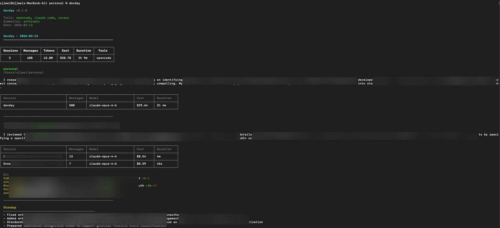

# devday

End-of-day recap for AI-assisted coding sessions. Reads your local conversations from OpenCode, Claude Code, Cursor, Codex, and GitHub Copilot CLI, cross-references with git, and generates standup-ready summaries.



## What it does

- Scans completed AI coding sessions from your local machine (nothing leaves your machine unless you enable LLM summaries)
- Shows tokens used, estimated cost, duration, and models per session
- Groups sessions by project and shows git commits alongside
- Optionally generates first-person standup messages via OpenAI or Anthropic
- Can generate conversational per-session worklog summaries and write one Obsidian inbox note per session

## Supported tools

| Tool | Data source |
|------|------------|
| OpenCode | `~/.local/share/opencode/storage/` |
| Claude Code | `~/.claude/` (SQLite + JSONL) |
| Cursor | `~/Library/Application Support/Cursor/User/globalStorage/state.vscdb` |
| Codex | `~/.codex/sessions/` (JSONL) |
| GitHub Copilot CLI | `~/.copilot/session-state/` (JSONL + workspace metadata) |
| Gemini CLI | WIP |

## Install

```bash
npm install -g devday
```

## Development

```bash
git clone https://github.com/ujjwaljainnn/devday.git
cd devday
npm install
npm run build
npm link
```

## Usage

```bash
devday                        # today's recap
devday -d yesterday           # yesterday
devday -d 2026-02-11          # specific date
devday --standup              # short standup format
devday --json                 # machine-readable output
devday --worklog              # detailed markdown worklog
devday --worklog --write-obsidian-inbox
devday --worklog --session-summary-instructions ./prompts/worklog-session-summary.md
devday --no-git               # skip git integration
devday --no-summarize         # skip LLM summaries
devday -v                     # debug output
```

## Obsidian worklog output

Generate a detailed conversational worklog:

```bash
devday --worklog
```

Write one inbox entry per session into your vault:

```bash
devday --worklog --write-obsidian-inbox
```

By default this writes to `~/obsidian-notebook/inbox/`.
Override the vault path if needed:

```bash
devday --worklog --write-obsidian-inbox --obsidian-vault ~/my-vault
```

Session summary instructions are loaded from markdown at runtime.
Default prompt file:

```bash
./prompts/worklog-session-summary.md
```

You can provide your own prompt file:

```bash
devday --worklog --session-summary-instructions ~/my-prompts/devday-session-summary.md
```

The worklog output includes separate tool and skill lists per session.

## AI summaries

Summaries are optional. Without an API key, devday shows stats and git only.

```bash
export OPENAI_API_KEY=sk-...      # or
export ANTHROPIC_API_KEY=sk-...
```

## How it works

devday reads completed sessions from each tool's local storage. Sessions are grouped by project directory, and git commits are matched by date.

Duration is calculated from actual message processing times (not wall-clock), capped at 5 minutes per message to handle tools that write bogus completion timestamps.

Cost is estimated from token counts and model pricing tables when the tool doesn't provide it directly.
